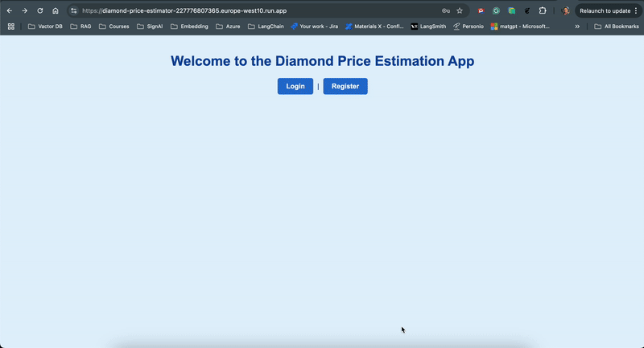

# Diamond Price Estimator

## Our team:
- [ Maneli Foroutan     @maneli_foroutan]
- [ Mahdi Savoji    @MahdiSavoji]
- [ Milad Behrooz   @milad689]
- [ Reza Karimi     @UchihaKinSlayer]

## Deployment
The Diamond Price Estimator application is deployed on Google Cloud Platform (GCP) using the following technologies:
- **Github Action**: The application uses GitHub Actions to automate the CI/CD (Continuous Integration and Continuous Deployment) pipeline. This ensures that code changes are automatically tested, built, and deployed to Google Cloud Platform.
- **Docker Container**: The application is containerized to ensure consistent deployment and scalability.
- **GCP Cloud Run**: For seamless serverless deployment, the application leverages Cloud Run, allowing it to scale automatically based on traffic.
## Application Access

The application can be accessed at the following URL (If you don't have access, please use a VPN.): 

https://diamond-price-estimator-227776807365.europe-west10.run.app/